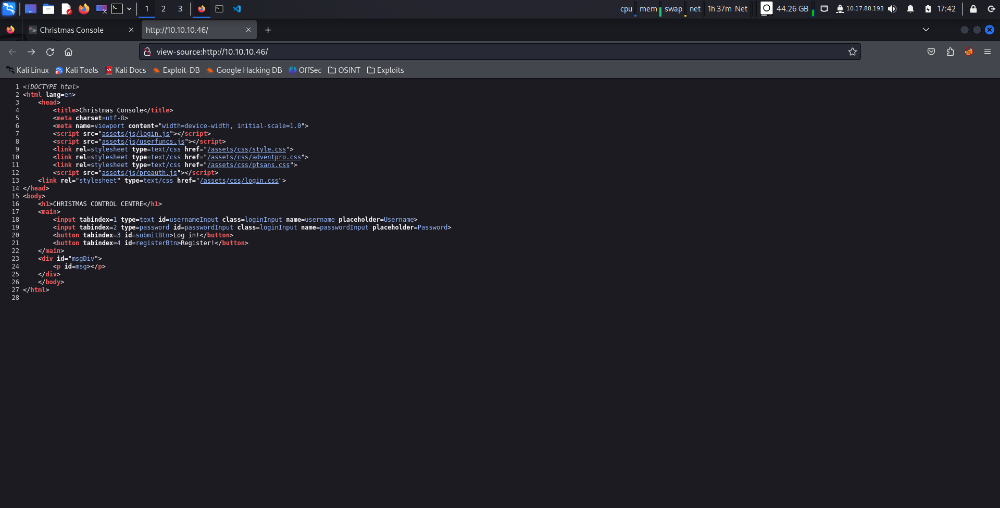

# This is the Write Up for day 1 challenge of Advent of Cyber 2K20 CTF.

> Pratyush Prakhar (5#1NC#4N) - 12/01/2020

## Description

"The Best Festival Company's brand new OpenVPN server has been hacked. This is a crisis!

The attacker has damaged various aspects of the company infrastructure -- including using the Christmas Control Centre to shut off the assembly line!

It's only 24 days until Christmas, and that line has to be operational or there won't be any presents! You have to hack your way  back into Santa's account (blast that hacker changing the password!) and getting the assembly line up and running again, or Christmas will be ruined!"

After giving you the assignment, McSkidy hands you the following dossier of important information for the task. Find the dossier [here](https://tryhackme.com/room/adventofcyber2) in day 1 task.

## Solution

1. When we navigate to the IP, we see a login form. As we are fellow hackers, our first instinct is to check for page source and other low hanging fruits. Do that as it is important in real life. Go for SQLi too. Check everything.

\

2. But the challenge wants us to explore the `cookie` part of the web application. So, let's start with registering the user and checking out the cookie involved through Inspector mode. On logging in with that account, we are greeted with a `view console` of the various processes of assembly line.

3. Let's now explore the session information stored to identify each user (logged in). This is done through `cookies`. On inspecting, we find that `auth` cookie with a possible `hex value` is being stored for each user to track their assembly line. Let's decode it to get more information on the secret that is being passed for verification. Maybe we ca trick the backend server for our use case.

4. On checking with [CyberChef](https://gchq.github.io/CyberChef/#recipe=From_Hex('None')&input=N2IyMjYzNmY2ZDcwNjE2ZTc5MjIzYTIyNTQ2ODY1MjA0MjY1NzM3NDIwNDY2NTczNzQ2OTc2NjE2YzIwNDM2ZjZkNzA2MTZlNzkyMjJjMjAyMjc1NzM2NTcyNmU2MTZkNjUyMjNhMjI3MzY4Njk2ZTYzNjg2MTZlMjI3ZA), our guess was indeed correct. The hex decode give us a value in `json` format in which the **username** is being passed to the backend server. So, now we have a working exploit to bypass the authentication. 

5. We can now reverse the process to get the cookie for `santa` and use that to access his assembly line although we don't know his creds. The server knows the cookie. See, passwords are not enough. We get the santa's cookie [here](https://gchq.github.io/CyberChef/#recipe=To_Hex('None',0)&input=eyJjb21wYW55IjoiVGhlIEJlc3QgRmVzdGl2YWwgQ29tcGFueSIsICJ1c2VybmFtZSI6InNhbnRhIn0).

6. Let's replace our cookie with santa's and refresh the page for reauth. And voila, we are in as Santa. Let's re-activate the assembly line and we get the flag thereafter. 

7. Done for the day. See you tomorrow. Keep exploring meanwhile.

## Brownie Points

1. What is the name of the cookie used for authentication? - **auth**.

2. In what format is the value of this cookie encoded? - **hexdecimal**.

3. Having decoded the cookie, what format is the data stored in? - **JSON**.

4. What is the value of Santa's cookie? - **7b22636f6d70616e79223a22546865204265737420466573746976616c20436f6d70616e79222c2022757365726e616d65223a2273616e7461227d**

5. What is the flag you're given when the line is fully active? - **THM{MjY0Yzg5NTJmY2Q1NzM1NjBmZWFhYmQy}**