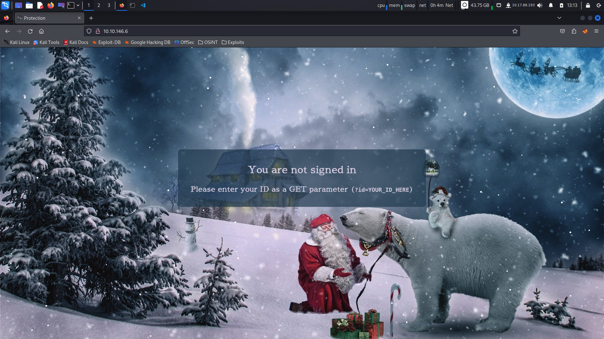
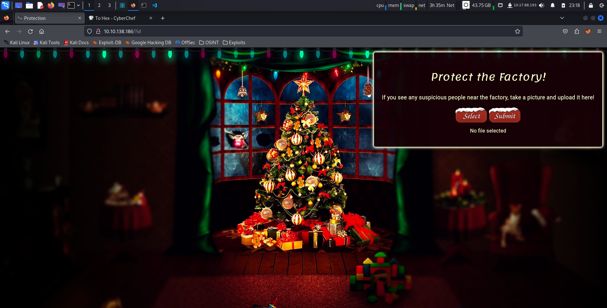
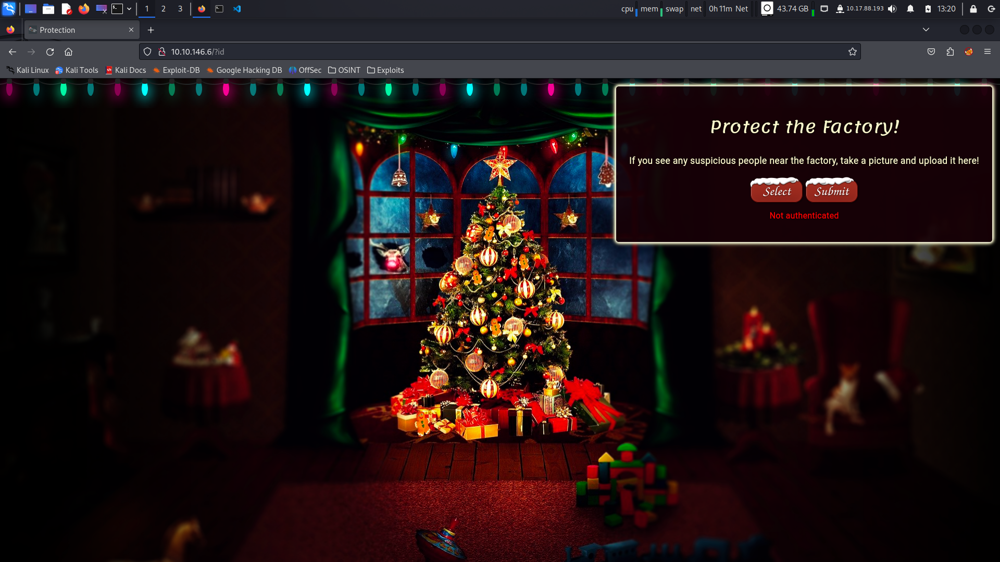
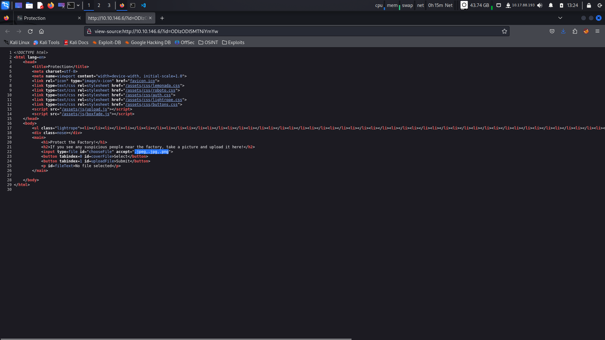
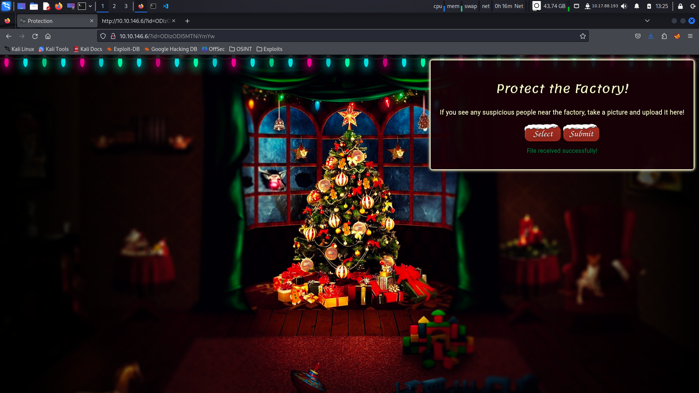
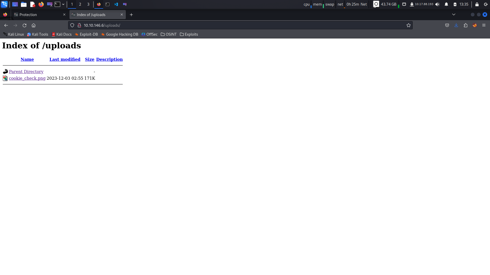
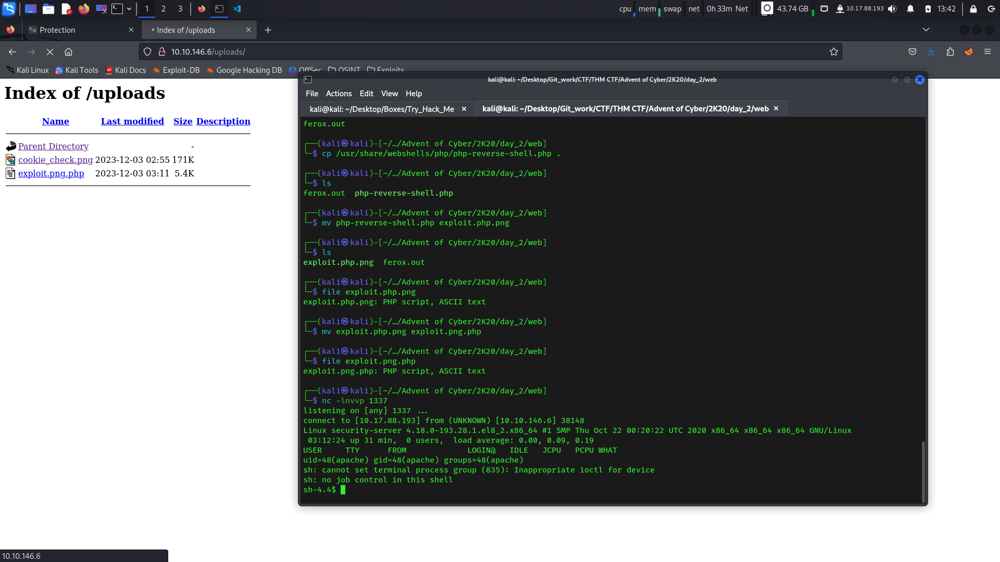

# This is the Write Up for day 2 challenge of Advent of Cyber 2K20 CTF.

> Pratyush Prakhar (5#1NC#4N) - 12/02/2020

## Description

After your heroic deeds regaining control of the control centre yesterday, Elf McSkidy has decided to give you an important job to do.

"We know we've been hacked, so we need a way to protect ourselves! The dev team have set up a website for the elves to upload pictures of any suspicious people hanging around the factory, but we need to make sure it's secure before we add it to the public network. Please perform a security audit on the new server and make sure it's unhackable!"

At the bottom of the dossier is a sticky note containing the following message:

For Elf McEager:
You have been assigned an ID number for your audit of the system: `ODIzODI5MTNiYmYw` . Use this to gain access to the upload section of the site.
Good luck!

## Solution

1. When we navigate to the IP, we see a static page. On that it asks us to supply a GET parameter `id`. Let's explore this.



2. Once you supply the parameter, we are redirected to a different page.
    1. On this page we can upload a file. 
    

    2. But when you just try to upload a file with a valid id, you get an auth error. So, there is a check for the valid id.
    

    3. We also need to know a valid `file type` for the upload even with the valid Elf McEager's id supplied to us. We can find it in the frontend page source of the page. 
    

3. So, let's use all this knowledge and upload a test image on the server. Kudos. We did it. Now, let's try o find where does this image sit. We can take help of a little friend - `feroxbuster`. There might be a sub folder somewhere on the server where these images go to.



4. We find through our [dirb](web/ferox.out) that their is an `uploads` directory which contains our images. And this makes for our exploit. Just need to trick the server to execute a malicious script for us to get in.



5. We use the above theory and attack path to get in.
    1. Upload the [exploit file](web/exploit.png.php) through the Protection website. Took some trails to get the **proper extension order**.
    2. Set up a netcat listener on my attacker machine to catch the call back.
    3. Invoke the exploit script from the **/uploads** folder. 
    4. And we get a call back. Phew the path works. Saved me more efforts.



6. Now we can go and fetch the flag located at `/var/www/flag.txt`

```sh
sh-4.4$ find / -type f -iname "*flag*" 2>/dev/null
find / -type f -iname "*flag*" 2>/dev/null
/proc/sys/kernel/acpi_video_flags
/proc/kpageflags
/sys/devices/pnp0/00:06/tty/ttyS0/flags
/sys/devices/platform/serial8250/tty/ttyS2/flags
/sys/devices/platform/serial8250/tty/ttyS3/flags
/sys/devices/platform/serial8250/tty/ttyS1/flags
/sys/devices/virtual/net/lo/flags
/sys/devices/vif-0/net/eth0/flags
/sys/module/scsi_mod/parameters/default_dev_flags
/var/www/flag.txt
/usr/bin/pflags
/usr/sbin/grub2-set-bootflag
/usr/share/man/man1/grub2-set-bootflag.1.gz
sh-4.4$ cat /var/www/flag.txt
cat /var/www/flag.txt


==============================================================


You've reached the end of the Advent of Cyber, Day 2 -- hopefully you're enjoying yourself so far, and are learning lots! 
This is all from me, so I'm going to take the chance to thank the awesome @Vargnaar for his invaluable design lessons, without which the theming of the past two websites simply would not be the same. 


Have a flag -- you deserve it!
THM{MGU3Y2UyMGUwNjExYTY4NTAxOWJhMzhh}


Good luck on your mission (and maybe I'll see y'all again on Christmas Eve)!
 --Muiri (@MuirlandOracle)


==============================================================
```

7. Extra treat
    1. We are in a no-login shell. So, common ptty upgrading skills don't work. Find other way out to do that.
    2. `root` is the only user with a proper shell. So, might want to find a escalation to it.
    3. You are currently apache. So, it will be a long road.

```sh
sh-4.4$ which $SHELL
which $SHELL
which: no /sbin/nologin in ((null))
sh-4.4$ cat /etc/passwd | grep sh$
cat /etc/passwd | grep sh$
root:x:0:0:root:/root:/bin/bash
sh-4.4$ whoami
whoami
apache
```

8. Good Luck. See you soon.

## Brownie Points

1. What string of text needs adding to the URL to get access to the upload page? - **?id=ODIzODI5MTNiYmYw**.

2. What type of file is accepted by the site? - **Images** - **.jpg, .jpeg, .png**.

3. In which directory are the uploaded files stored? - **/uploads/**.

4. What is the flag in /var/www/flag.txt? - **THM{MGU3Y2UyMGUwNjExYTY4NTAxOWJhMzhh}**
