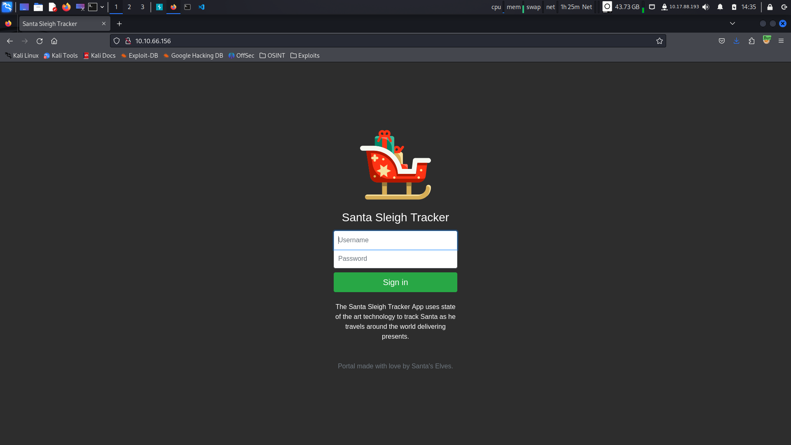
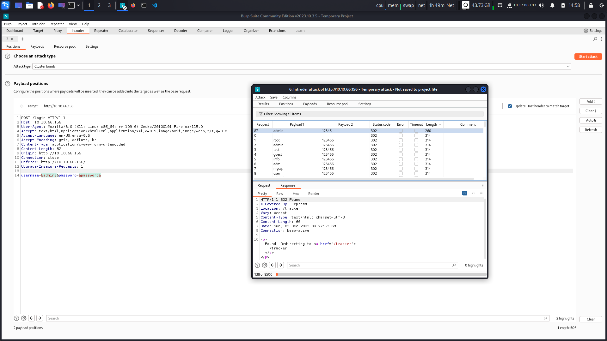
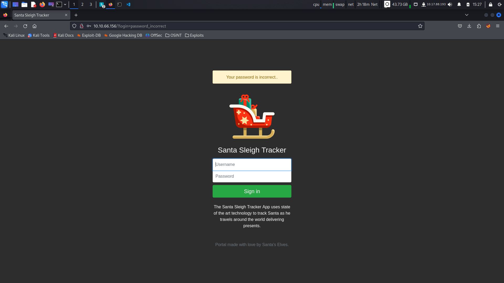
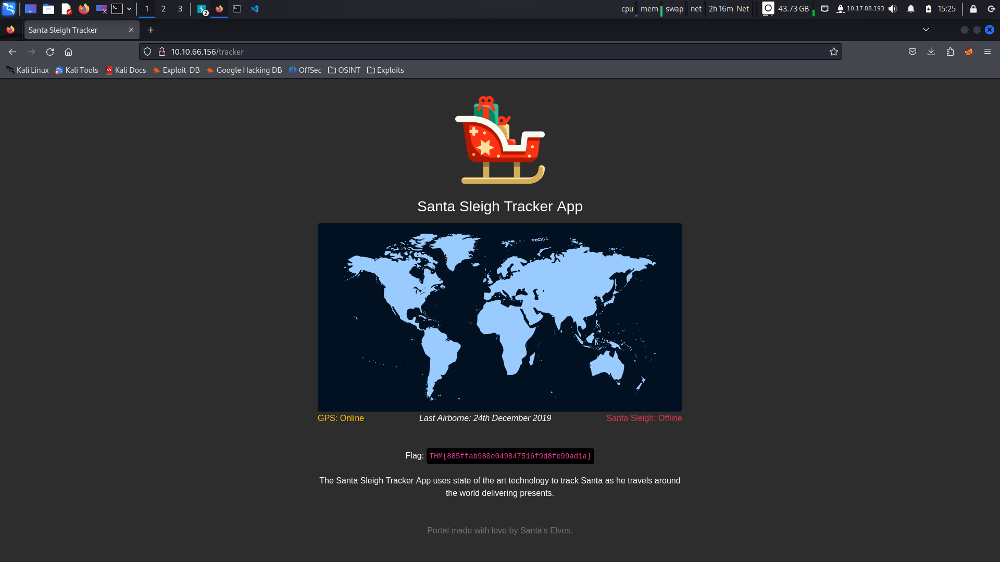

# This is the Write Up for day 3 challenge of Advent of Cyber 2K20 CTF.

> Pratyush Prakhar (5#1NC#4N) - 12/03/2020

## Description

McSkidy is walking down the corridor and hears a faint bleeping noise, Beep.... Beep.... Beep... as McSkidy gets closer to Sleigh Engineering Room the faint noise gets louder and louder.. BEEP.... BEEP.... Something is clearly wrong! McSkidy runs to the room, slamming open the door to see Santa's sleighs control panel lite up in red error messages! "Santa sleigh! It's been hacked, code red.. code red!" he screams as he runs back to the elf security command center.

Can you help McSkidy and his team hack into Santa's Sleigh to re-gain control?

`This challenge is all about creds bruteforcing and password cracking.`

## Solution

1. When we navigate to the IP, see a login form. You can work on all the basic checks and low hanging fruit. But let's focus at the task at hand - creds bruteforcing.

2. We can go two different ways. 
    1. The Burpsuite Intruder method. This GUI is the intended way for the task.
    2. The CLI method. We can use a bruteforcer like `Hydra` for it.

3. Let's explore the BurpSuite method. We can use the `Cluster Bomb` mode to run all the possible combinations. For this I am using the top 110 username and top 500 passwords to start. If it doesn't work, we can move to the next bigger lists. But we cracked it at this level. This means the admin was a little weak.

4. Now let's check for valid usernames and passwords using Hydra.
    1. We can check for a valid username by checking for `login=username_incorrect` in the response. We find the valid username in the [file here](hydra/user.txt).
    

    2. We can now use this information to now find a valid password by looking for `?login=password_incorrect` in the response.
    

    3. Valid set of creds were found as [here](hydra/pass.txt).

5. Thus, we have now obtained valid set of credentials that we can use to login. You can use any other fuzzer to do the same. Let's get that flag now.

6. We see in Santa's sleighs control panel that the sleigh is offline. Let's fix that and save the day.

## Brownie Points

1. What is the flag? - **THM{885ffab980e049847516f9d8fe99ad1a}**.
